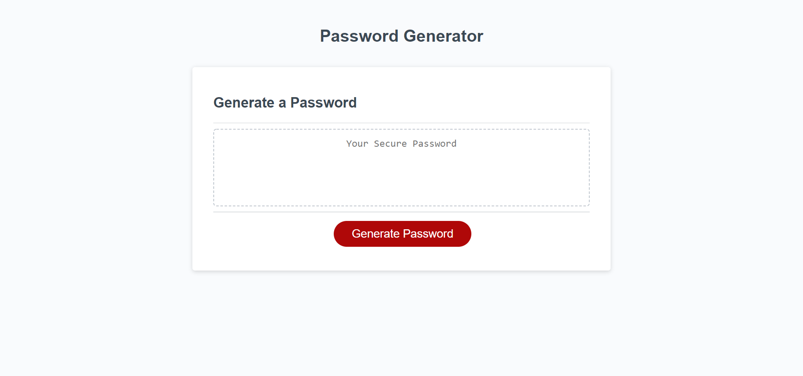

# Password Generator

## Description
This is my Weekly Challenge #3 for my Coding Boot Camp class. The assignment was to create an application that is used to generate a random password. Criteria for the password would be a length of 8 to 128 characters and the choice of lowercase, uppercase, numerals, and/or special characters. After going through all prompts, the password will be generated and displayed on the page.

[Live URL](https://dmorgan904.github.io/new-password/)

### Installation
1. Create prompt asking the user how long he/she desires the password to be, but still staying within the character length criteria.
2. Create variable declarations for prompts using Booleans. These variable declarations would ask the user the criteria he/she desires to include in the password (uppercase, lowercase, numerals, and/or special characters). One must be chosen or the while loop would start over.
3. Create arrays for character choices.
4. Create while loop for character choices and password length so that the password will be randomly generated.

### Usage
This application can be used by an employer to gain access to sensitve data. A new password must be created every time so that one is not written down or remembered. This can also be used by someone who has trouble thinking of new passwords.

## Credits
I collaborated with Kip, a classmate, to better understand how to get started with this project so I would like to give him a huge thank you.
